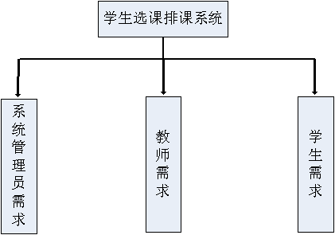
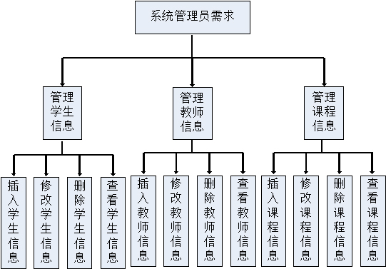
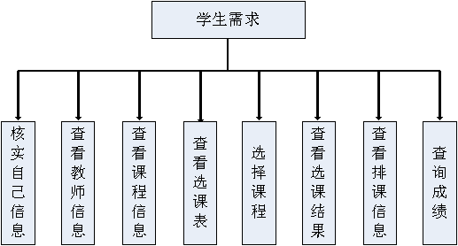
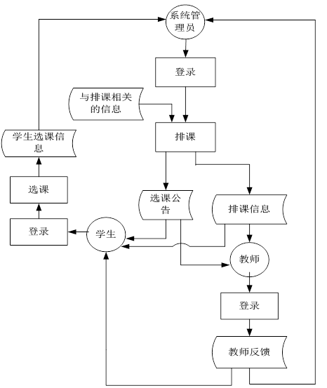
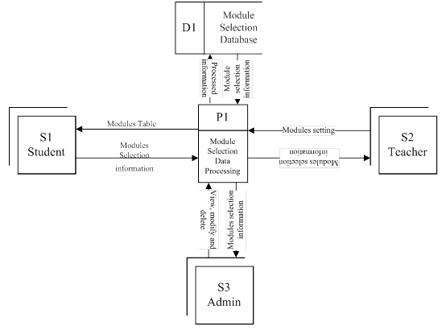
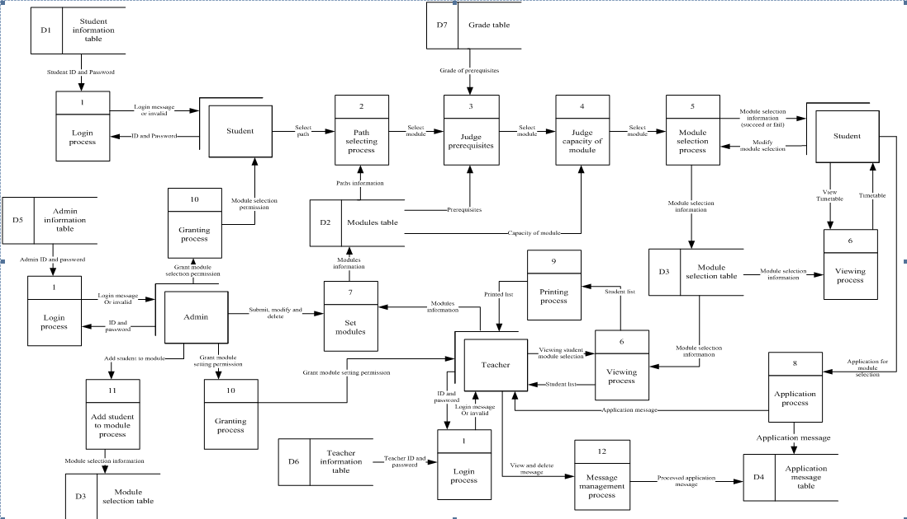
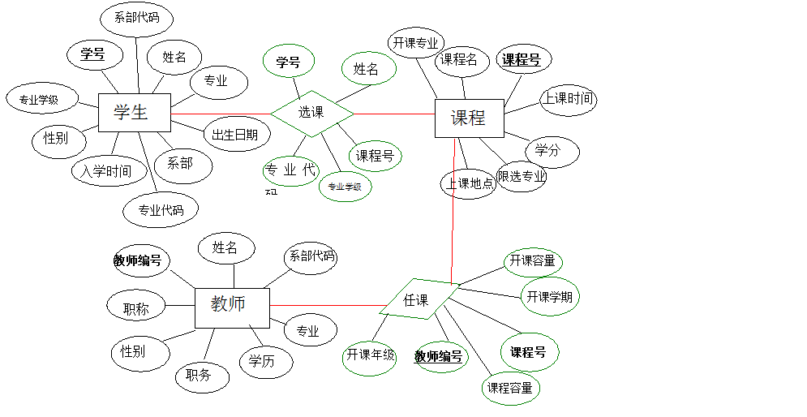
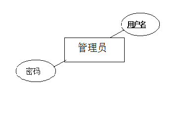

# 学生选课系统   
# course registration system

## Preface 前言

## Directory 目录

## Content 内容

### Background 开发背景

本项目所开发的学生选课系统完成学校对学生的选课信息的统计与管理，减少数据漏掉的情况，同时也节约人力、物力和财力，告别以往的人工统计。学生在规定选课时间段内，可以不受地点和时间的限制完成选修课的申请，而学校也可以方便地对系统进行管理和控制，提高工作效率。方便学生、老师、管理员使用，学生可以在线查看可选课程信息、在线选课、修改信息、查看信息，老师可以查询自己的课程人数、课程信息（包括开课时间、地点、开课方式），管理员可以对整个系统进行管理（包括系统管理、用户管理、课程管理）。   

***

### Requirment analysis 需求分析

##### 整体需求分析

##### 管理员

* **排课的功能需求**  

1. 说明：学生选课之前，院系教务管理人员要合理安排课程。  
2. 录入：被排课程的课程号，各课程的上课地点、时间、授课教师。  
3. 加工：系统对教务管理员提交的排课表进行验证，验证成功之后，把排课表输入到数据库中，更新数据库。   
4. 输出：输出排课成功与否的提示信息，并将排课成功的排课表分年级输出到屏幕上并发布选课信息。  

* **基本资料管理的功能需求**  

1. 说明：此功能实现对学生、教师、课程基本资料的添加、删除、更新、查询。管理员利用数据库进行管理。
2. 录入：输入学生、教师、课程的基本属性。详见数据字典部分。
3. 加工：教务管理员对所提交的学生，教师，课程信息通过系统进行检查、验证，验证通过之后把有关信息录入数据库中，更新数据库。
4. 输出：输出学生，教师，课程基本资料信息表。  

* **设置各级用户的权限功能需求**  

1. 说明：此功能实现对各用户赋予不同的用户权限。教务管理员利用数据库管理技术进行权限设置。  
2. 录入：无  
3. 加工：教务管理员对各用户赋予不同的用户权限，系统验证这些权限设置，通过后，进行系统更新。  
4. 输出：给出所设置的用户的权限说明。  

##### 学生选课子系统

* **查询的功能需求**

1. 说明：此功能使学生可以查询本学期的开课计划，包括课程的详细信息，专业课查询，选修课查询，已选课查询等。  
2. 录入：通过友好的交互界面，使学生通过点击鼠标就可以实现各种查询功能。  
3. 加工：系统通过点击鼠标所提交的查询请求，利用数据库系统的查询功能查询出符合要求的记录。  
4. 输出：在屏幕上显示查询后的结果，通常以报表的形式显示。  

* **选课的功能需求**  

1. 说明：此功能使学生实现在网上选课。  
2. 录入：通过友好的交互界面，使学生通过点击鼠标选择课程号，是否购买教材等。  
3. 加工：学生提交要选课程的表单后，系统进行验证表单中的数据，选课号是否正确，学分是否已满25学分，不能重课。  
4. 输出：显示课程是否选中的标记。  

* **退课的功能需求** 

1. 说明：此功能使学生实现在网上退课。  
2. 录入：通过友好的交互界面，使学生通过点击鼠标进行操作，提交数据。  
3. 加工：系统进行验证提交的数据，不能删除空数据，验证通过后删除课程，并给出提示信息。
4. 输出：输出删除成功的标记，重设课程是否选中的标记 。

##### 教师管理子系统

* **选课查询的功能需求**

1. 说明：此功能使教师查询选课的情况。
2. 录入：教师所教课程的课程号，实现时应是鼠标操作。
3. 加工：系统根据所提交的课程号，进行相应的查询。
4. 输出：将查询后的结果输出到屏幕上，应包括课程的基本信息

### Methodologies 开发方法

##### Waterfall model 瀑布流开发

In Royce's original waterfall model, the following phases are followed in order:  

1. Requirements specification
* Design
* Construction (implementation or coding)
* Integration
* Testing and debugging
* Installation
* Maintenance

### Structured Analysis 结构化分析法

##### Transaction Flow Diagram 业务流程图

##### Data Flow Diagrams 数据流图

* **顶层数据流图**

* **二级数据流图**

##### Entity Relationship Diagram ER图

##### Data Dictionary 数据字典

